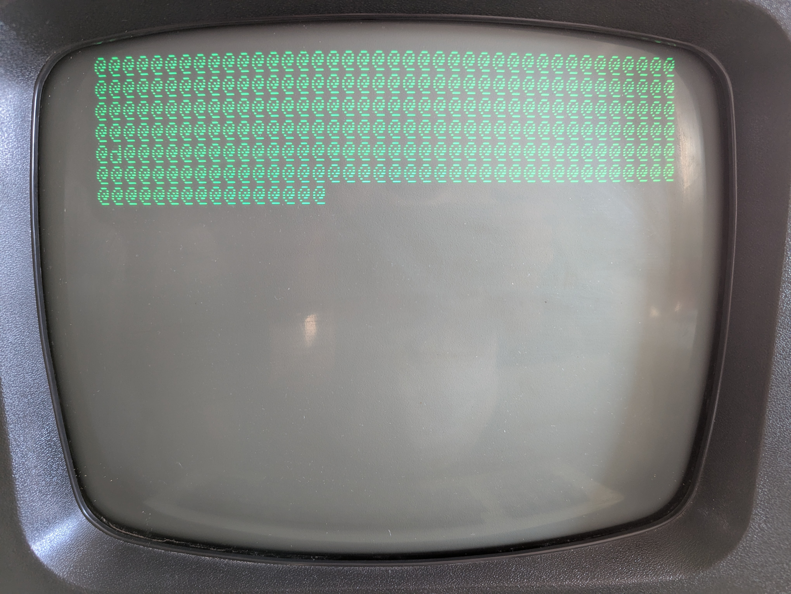

# SCREENSHOTS

## A working "4032"  (actually an upgraded 4016)

_These pictures were kindly supplied by Colin._

These photographs were taken at various stages throughout the testing
of a fully-working, 40-column, CRT-based Commodore PET.  It can be
seen from the timestamps that the full test lasts about an hour and a
quarter; including a pause for photography between each test and the
next.

### The workspace test

Here we are about to test a chunk of 256 bytes of the screen memory,
which we can use as a workspace to hold variables and code, which will
allow us to manage without a stack (for subroutine calls and super
temporary storage) or zero page (for indirect addressing modes) until
we have proved pages 00 and 01 good.

### After the stack and refresh tests
 At the end of the stack test, it will contain all zeros.  If, during
the pause after the stack test, while we have not been making enough
memory accesses to keep the memory refreshed, any bits have changed
from 0 to 1, this will be picked up as a fault with the refresh
circuit.

### After the zero page test

By this point, we can be reasonably confident that we have a
mostly-working machine.

### Testing for address clashes

Pages 02, 04, 08, 10, 20 and 40 are tested in turn for address clashes
with page 00.  Such a fault would indicate a problem with one of the
high-order address lines A8-A14.  Unpopulated memory locations read
back as the high-order byte of their addresses, so this test will
indicate how much memory is fitted.

### Page-by-page memory testing

Each page from 02 to 7F is tested in turn for stuck bits and address
clashes within the page.

### Testing the upper 16K

### Finished!

The PET has had its screen memory and program memory tested for stuck
zeros, stuck ones, address clashes and refresh faults, and passed all
the tests.

