# SCREENSHOTS

## The Test Screen
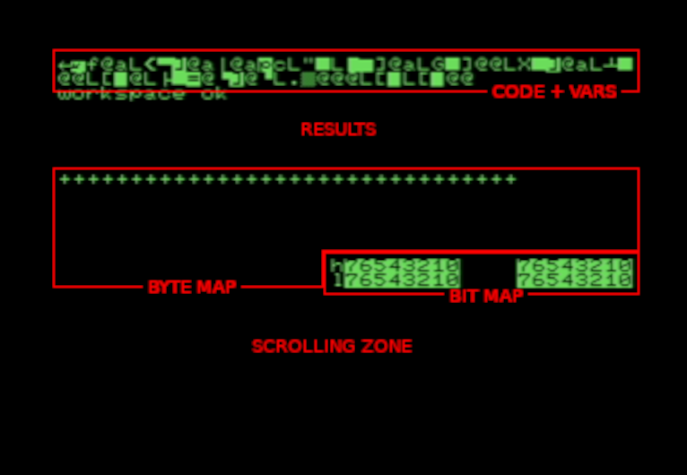
This shows the various important zones on screen during the main test:

+ Code and variables
+ Results area
+ Byte Map -- results of each byte within the block under test
+ Bit Map -- which bits failed in any byte in the high and low blocks
+ Scrolling Zone -- shows the most recent 9 failure messages

## A working "4032"  (actually an upgraded 4016)

_These pictures were kindly supplied by Colin._

These photographs were taken at various stages throughout the testing
of a fully-working, 40-column, CRT-based Commodore PET.  It can be
seen from the timestamps that the full test lasts about an hour and a
quarter; including a pause for photography between each test and the
next.

### The workspace test

Here we are testing a chunk of 256 bytes of the screen memory, which we
can then use as a workspace. This will allow us to manage without a
stack (needed for subroutine calls and super-temporary storage) or zero
page (needed for indirect addressing modes) until we have proved pages
01 and 00 respectively to be good.

This space will eventually be used to store variables and code (in the
first two rows of the screen) and display results.

If the rest of the screen memory is behaving correctly, rows 8-15 will
be used to show progress of the test and rows 16-25 will be used as a
scrolling text window showing copies of the most recent error messages.

As this is the screen memory, the values in these locations will cause
characters to be displayed on the screen. The "d" visible in this
picture, in row 4, column 1, shows that the hex value 04 has been
written to location (hex) 80a1 and must have been correctly read back;
locations 80a0 down to 8000 and 80a2 up to 80ff will then be tested in
turn to make sure they still contain all zeros.

### After the stack and refresh tests
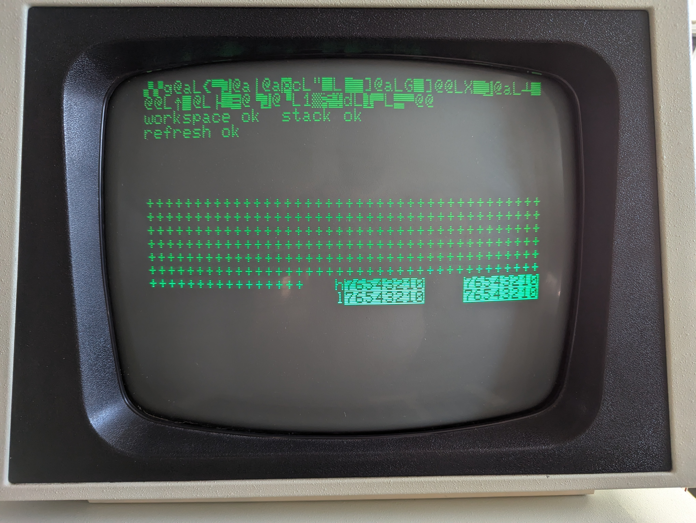
At the end of a successful stack test, page 01 will contain all zeros.
There will then be a pause, during which time we will not be accessing
enough different memory accesses to keep the whole of memory refreshed.
If, after this pause, any bits within page 01 are found to have changed
from a zero to a one, this will be picked up as a fault with the RAM
refresh circuit.

Rows 8-14 indicate memory locations tested. A + sign indicates a pass.
A "W" indicates a **W**rite and readback error. An "F" indicates a
re**F**resh error. An "R" indicates a **R**read error.

The four sets of numbers 0-7 displayed in inverse at the ends of rows
14 and 15 are used to indicate faults in those bits in the high and
low 16K banks; which can be mapped to ICs UA4-19, as shown below:

Bank \ Bit |   7 |   6 |   5 |    4 |    3 |    2 |    1 |    0
-----------|-----|-----|-----|------|------|------|------|------
high       | UA4 | UA6 | UA8 | UA10 | UA12 | UA14 | UA16 | UA18 
low        | UA5 | UA7 | UA9 | UA11 | UA13 | UA15 | UA17 | UA19 

The positions on the left will change to W if a write / readback error
is detected in the corresponding bit in any location in the
corresponding bank; and, in the refresh test only, F if a refresh
fault is detected in the corresponding bit in any location.

The positions on the right will change to R if a read error is detected
in the corresponding bit in any location in the corresponding bank;
or, where applicable, in the alternate bank.

### After the zero page test
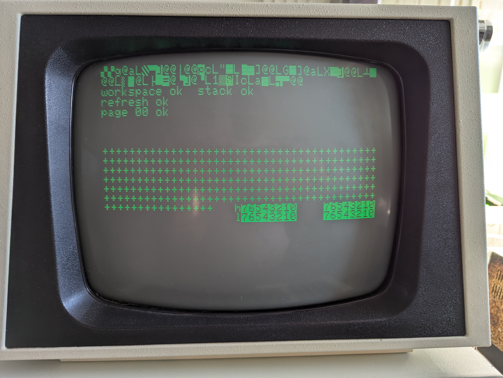
By this point, we can be reasonably confident that we have a mostly
working machine. Certainly the beginning of screen RAM must be good,
and not clashing with pages 00 or 01, or else the program would have
crashed. We have also proved that page 01, which is used for the 6502
stack, is good; page 00, which is used in various instructions as a
kind of extended register set, is also good; there are no clashes
between these pages; and the memory refresh counter and its associated
tristate buffers are working properly.

However, we have not yet tested the majority of the PET's memory; and
we have only tested for address clashes in the low-order address bits
A0-A7. 

### Testing for address clashes
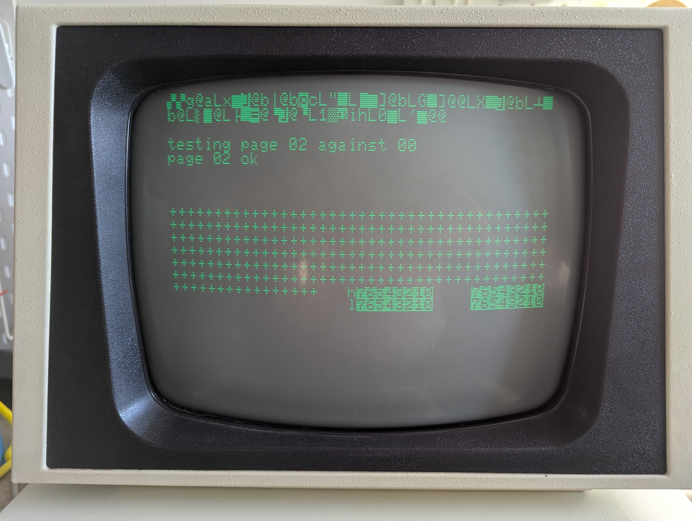
Pages 02, 04, 08, 10, 20 and 40 are tested in turn for address clashes
with page 00.  Such a fault would indicate a problem with one of the
high-order address lines A8-A14.  Unpopulated memory locations read
back as the high-order byte of their addresses, so this test will
indicate how much memory is fitted.

Memory size | Pass | Fail
------------|------|------------
32K         |  All |       None
16K         |   20 |         40
8K          |   10 |     20, 40
4K          |   08 | 10, 20, 40

Faults in the high bank may cause 32K to test as 16K and 8K as 4K.

### Page-by-page memory testing
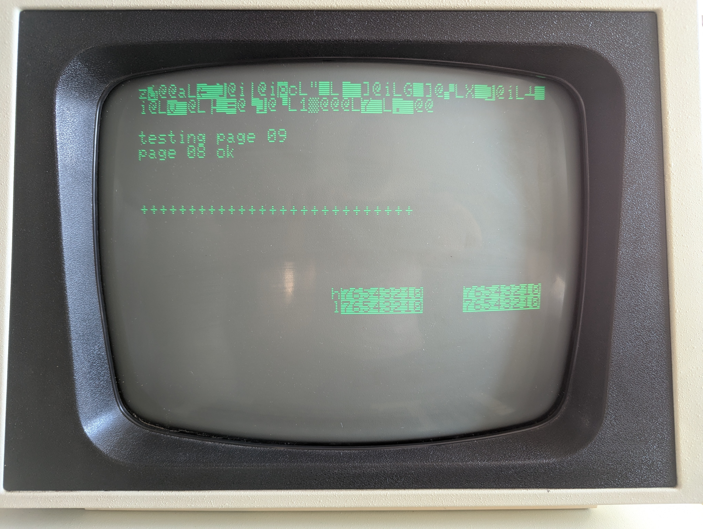
Each page from 02 to 7F is tested in turn for stuck bits and address
clashes within the page.

### Testing the upper 16K
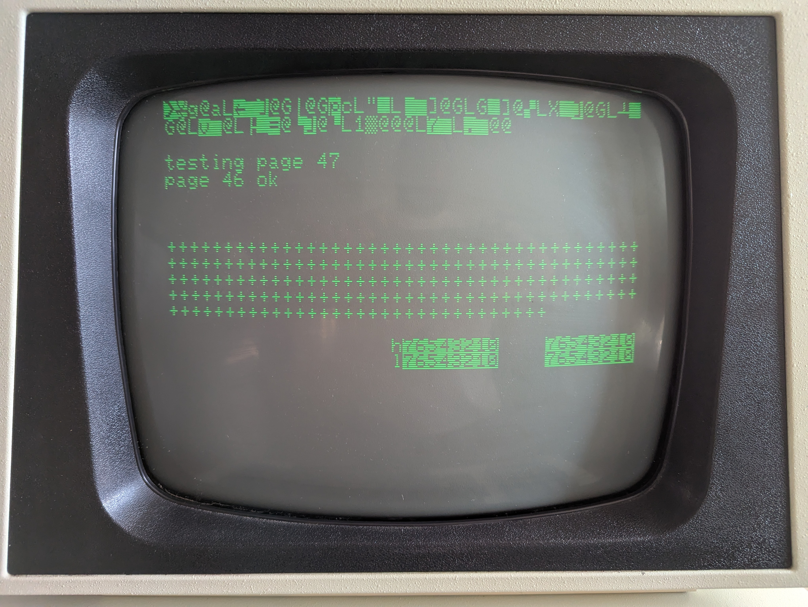

### Finished!
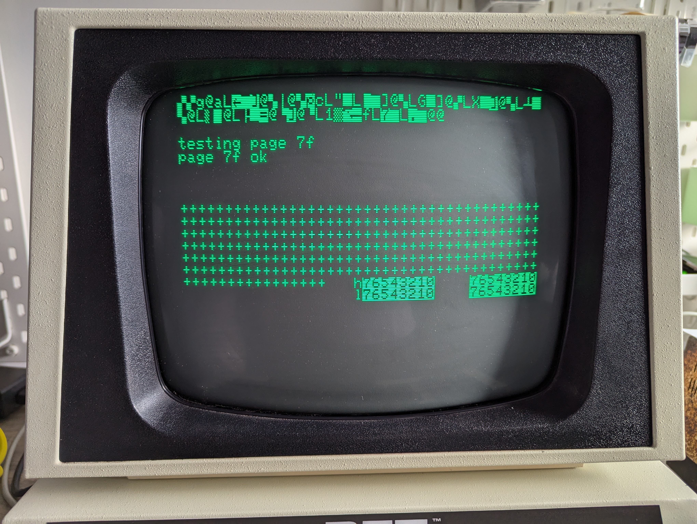
The PET has had its screen memory and program memory tested for stuck
zeros, stuck ones, address clashes and refresh faults, and passed all
the tests.

## A Memory Fault

These photographs show a PET with a faulty 4116 DRAM IC in position
UA6, which corresponds to bit 6 (hex 40) in the upper 16K bank (hex
4000 to 7fff).

### Address Clash Test Failure
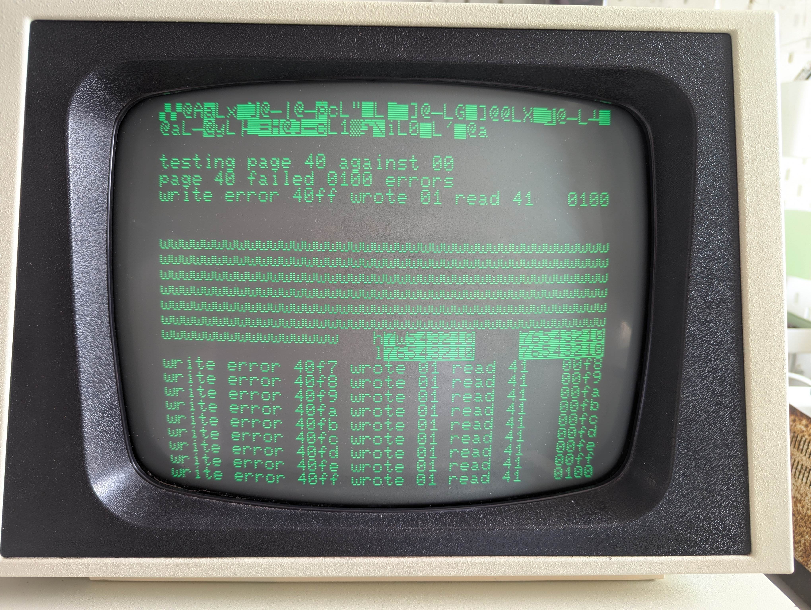
Here we have tested for address clashes between page 40 and page 00,
and at every location we had a write failure. We wrote 01 to the
location under test but read back 41. After this, we wrote a W in the
map of locations tested, restored 00 to the location under test and
moved straight on to the next location. The W in position 6 of the high
bank shows that only this bit failed.

Referring to the above table, this suggests UA6 could be faulty.  (Or
this could be a 16K machine; in which case, this result is to be
expected.)

### Page-by-page Test Failure
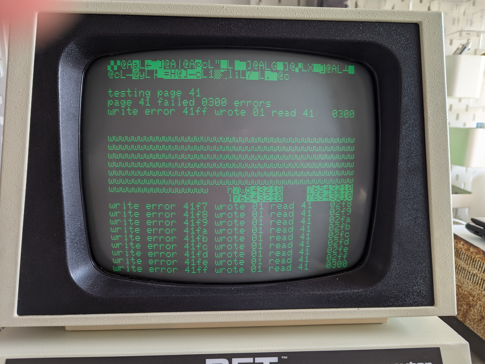
Here we have tested pages 40 and 41, and in each case found an error in
every one of the 256 locations in the page; bringing the cumulative
error count up to 768 decimal = 0300 hex.

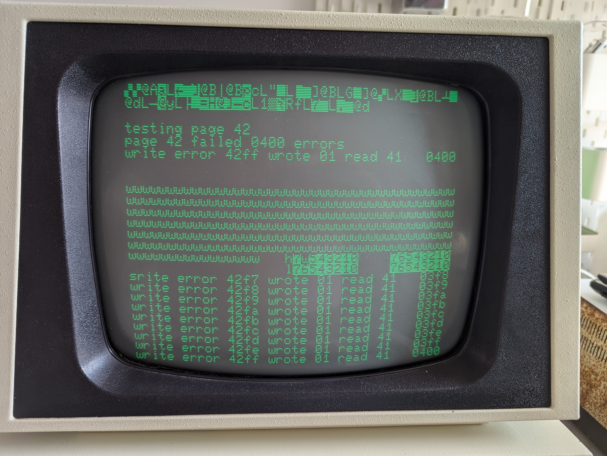
Here we have tested page 42, again with errors in every location.

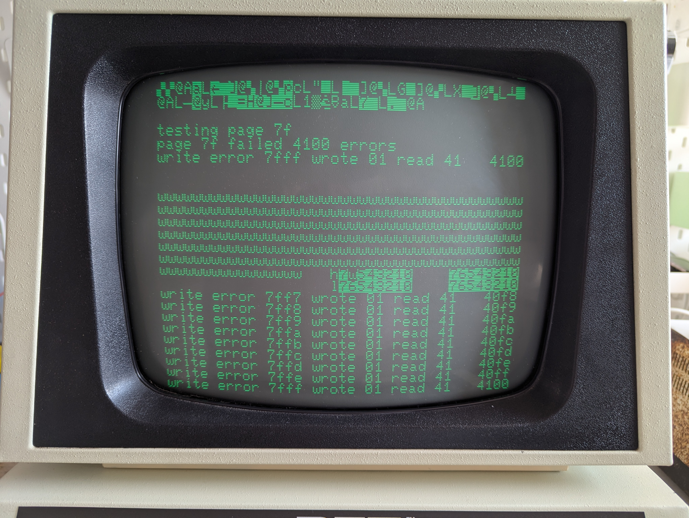
By the time we have reached the end of page 7f, we have a grand total
of hex 4100 errors; of which 100 occurred when testing page 40 for
address clashes against page 00, and a further 100 occurred in each
page from 40 to 7f. The errors involved only bit 6 in the high bank.

This indicates that the fault almost certainly involves UA6; either the
chip is bad, or there could be a poor connection on one or more of its
pins (the latter would be more likely if the fault did not involve a
round number of memory locations; a multiple of 100 or 80 suggests a
more consistent fault).
